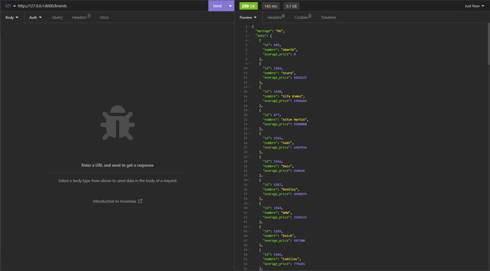
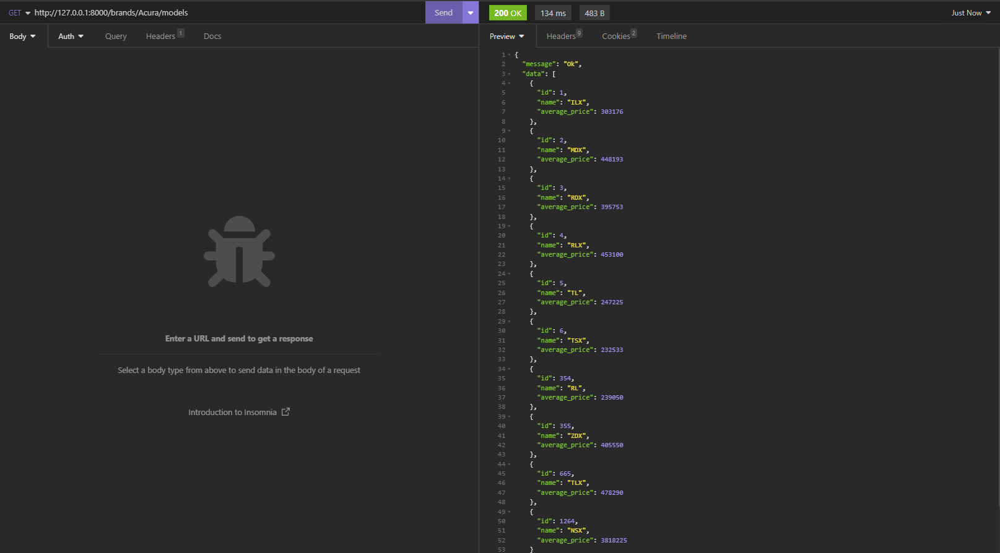
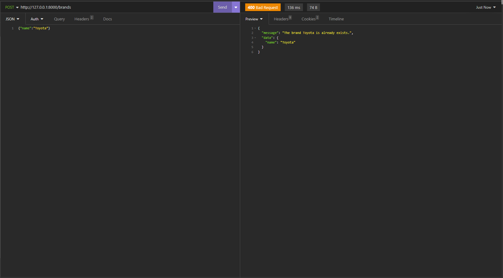
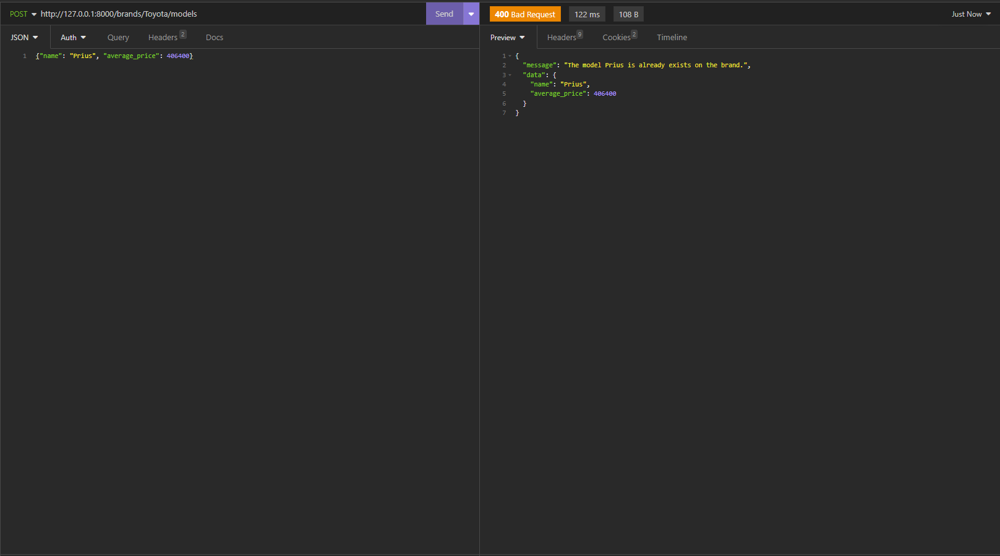
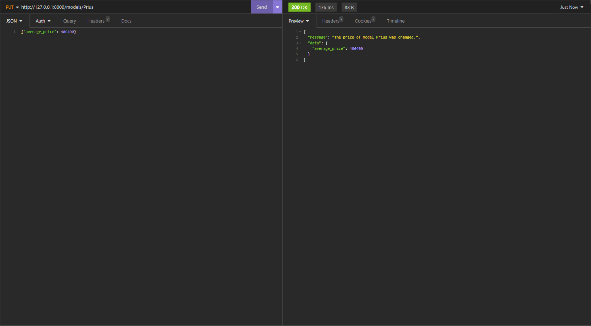
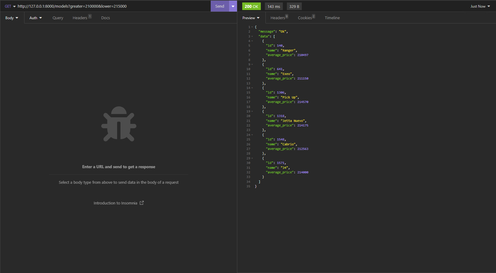

Victor Manuel Valdovinos Orozco</a>

## Información proyecto

Proyecto realizado en Laravel 9
Base de datos mysql, se adjunta base en ruta /databasetest/victor_test.sql

Requerimientos
- PHP.
- COMPOSER.
- MYSQL O MARIADB.

## Instruciones de ejecucion

Instalar php8.0.2 o mayor y mysql 
Instalar composer
Descargar proyecto desde git
Actualizar repositorios de laravel con composer update
Correr en modo development con php artisan serve
Abrir en navegador http://127.0.0.1:8000

## Funciones

Ruta GET /brands

-Muestra listado de las marcas.

Ruta GET /brands/:id/models

-Muestra listado de modelos de una marca.

Ruta POST /brands

-Inserta una nueva marca.

Ruta POST /brands/:id/models

-Inserta un nuevo modelo en una marca.

Ruta PUT /models/:id

-Actualiza precio de un modelo.

Ruta GET /models

-Muestra listado en base a precios.

